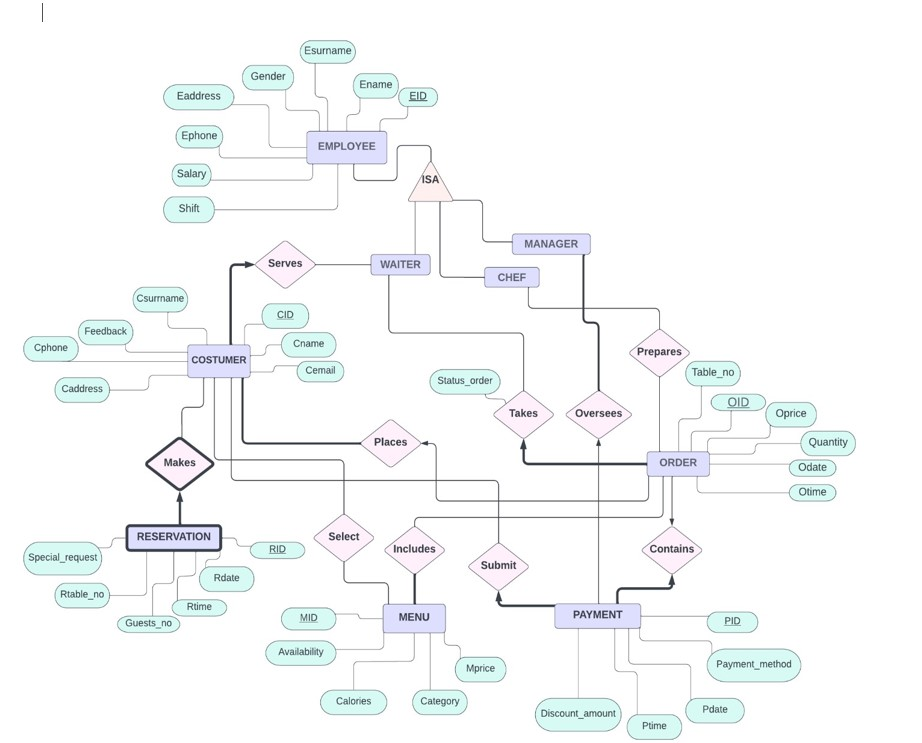
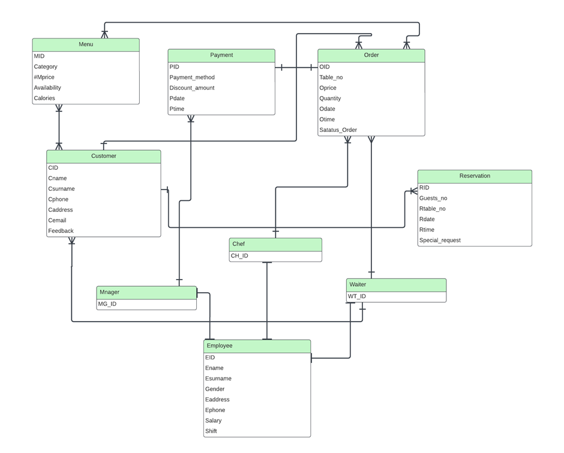
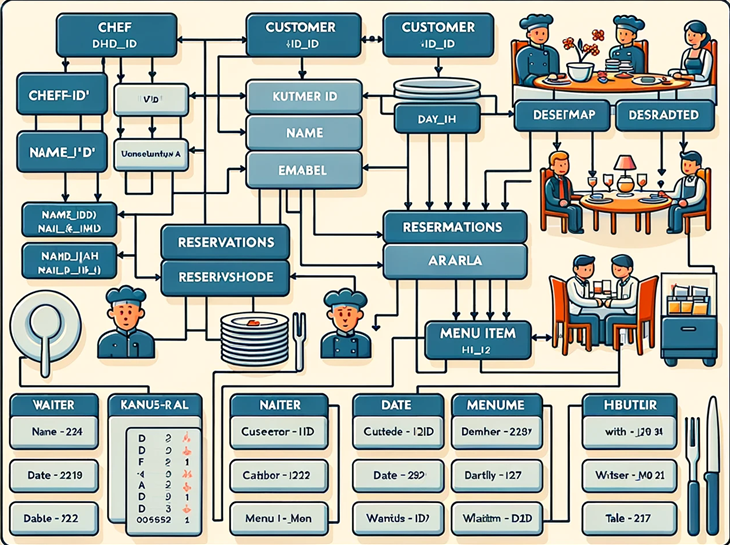

# Restaurant Management System

## About the Project
"Restaurant Management System" migration project aims to transition the existing MySQL-based system to a NoSQL database, specifically MongoDB. This migration process involves transferring data from MySQL tables to MongoDB collections, allowing for a more flexible and scalable data storage solution.

## Project Overview
The Restaurant Management System comprises various tables in MySQL, including Employee, Customer, Reservation, Order, Menu, Payment, and more. By migrating this relational database to a NoSQL database, we aim to take advantage of the benefits offered by NoSQL databases, such as schema flexibility, scalability, and better support for unstructured data.

## Migration Steps
Migrating the Restaurant Management System to MongoDB involves several steps:
``` 
1. Clone the Repository 
- git clone <https://github.com/AlbaAdili/Restaurant-Management-System.git>
2. Navigate to the Project Directory
- cd Restaurant-Management-System
3. Install Dependencies
- pip install pymysql
- pip install pymongo
4. Configure Database Connections
- Update the connection details for both MySQL and MongoDB in the configuration lines
```
### Data Migration Details

During the migration from MySQL to MongoDB, certain data types are converted to ensure compatibility with MongoDB's document-oriented structure:

- **Decimal to Float**: Decimal values are converted to floats.
- **Date to Datetime**: Date values are converted to datetime.
- **Timedelta to Seconds**: Timedelta values are converted to total seconds.

These conversions are handled by the `convert_value` function in the migration script.
## Diagram
The Entity-Relationship (ER) Diagram illustrates the structure of our database. This visual representation showcases the relationships between entities in our system. Use the diagram as a reference to understand the data model and the connections between key components in our application. 
### E-R Diagram



### Relational Schema
The following is an overview of the relational schema for the MySQL database used in the Restaurant Management System
######


## Data Model in MongoDB



#####

