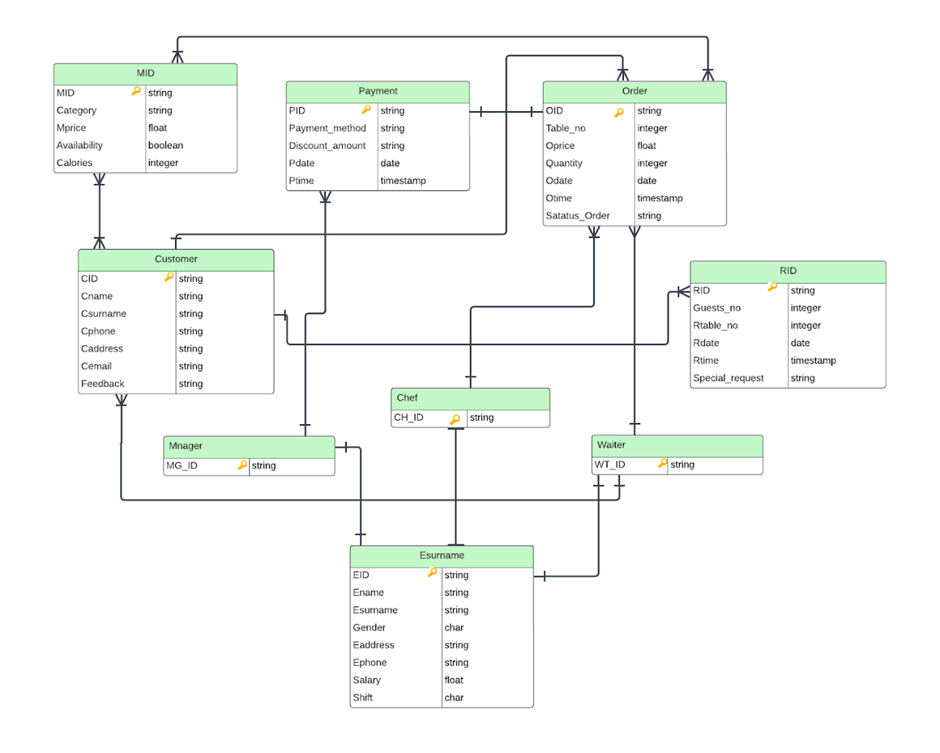

# Restaurant Management System

## About the Project
"Restaurant Management System" migration project aims to transition the existing MySQL-based system to a NoSQL database, specifically MongoDB. This migration process involves transferring data from MySQL tables to MongoDB collections, allowing for a more flexible and scalable data storage solution.

## Project Overview
The Restaurant Management System comprises various tables in MySQL, including Employee, Customer, Reservation, Order, Menu, Payment, and more. By migrating this relational database to a NoSQL database, we aim to take advantage of the benefits offered by NoSQL databases, such as schema flexibility, scalability, and better support for unstructured data.

## Migration Steps
Migrating the Restaurant Management System to MongoDB involves several steps:
``` 
1. Clone the Repository 
- git clone <https://github.com/AlbaAdili/Restaurant-Management-System.git>
2. Navigate to the Project Directory
- cd Restaurant-Management-System
3. Install Dependencies
- pip install pymysql
- pip install pymongo
4. Configure Database Connections
- Update the connection details for both MySQL and MongoDB in the configuration lines
```
## Step-by-Step Guide

#### 1. Set Up Relational Database (phpMyAdmin)
Install Necessary Packages:
Ensure you have XAMPP or any other LAMP/WAMP stack installed to use phpMyAdmin.

Import Database:

Open phpMyAdmin in your web browser (http://localhost/phpmyadmin).
Create a new database named Hospital_Management_System.
Import the Hospital_Management_System.sql file into this database. Ensure all tables and data are properly imported.
#### 2. Set Up NoSQL Database (MongoDB)
- Install Docker Desktop:

- Download and install Docker Desktop from Docker’s official website.
Install MongoDB Compass:

- Download and install MongoDB Compass from MongoDB’s official website.
- Create Docker Compose File:

Create a new directory for your project.
Inside this directory, create a file named docker-compose.yml with the following content:
````
version: '3.1'
services:
  mongo:
    image: mongo:latest
    volumes:
      - mongo-data:/data/db
    ports:
      - "27017:27017"

  mongo-express:
    image: mongo-express:latest
    depends_on:
      - mongo
    environment:
      ME_CONFIG_MONGODB_SERVER: mongo
    ports:
      - "8081:8081"

volumes:
  mongo-data:

````
#### 3. Launch MongoDB and Mongo Express:
Open a terminal, navigate to the directory containing the docker-compose.yml file, and run the following command to start the services:
sh
````
docker-compose up -d
````
#### 4. Connect to MongoDB:
Open MongoDB Compass.
Connect to the database using the connection string: mongodb://localhost:27017.
Create a new database named Hospital_Management_System.

#### 5. Run the Migration Script

``python migrate.py
``
### Data Migration Details

During the migration from MySQL to MongoDB, certain data types are converted to ensure compatibility with MongoDB's document-oriented structure:

- **Decimal to Float**: Decimal values are converted to floats.
- **Date to Datetime**: Date values are converted to datetime.
- **Timedelta to Seconds**: Timedelta values are converted to total seconds.

These conversions are handled by the `convert_value` function in the migration script.

## Data Model in MongoDB




## Notes
- Ensure that both MySQL and MongoDB are running and accessible before running the migration script.
- Review the data types and schema differences between MySQL and MongoDB to handle any necessary conversions or adjustments during migration.
- Monitor the migration process for any errors or inconsistencies and address them accordingly.

## Technologies Used
- Python: Scripting language used for writing the migration script.
- pymongo: Python driver for MongoDB, used for interacting with MongoDB databases.
- pymysql: Python driver for MySQL, used for accessing MySQL databases.
